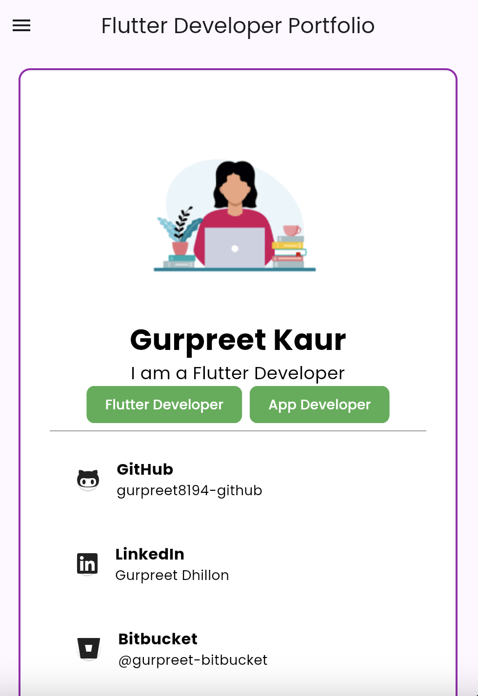
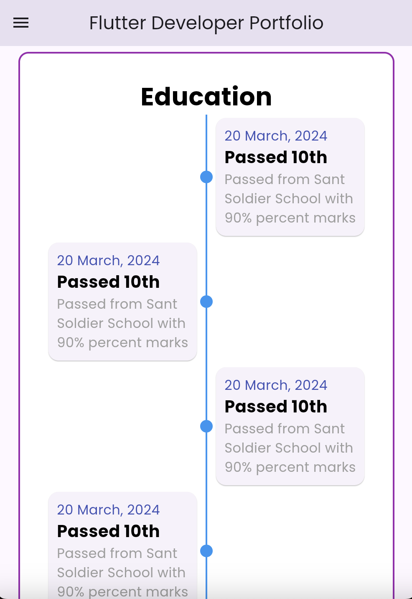
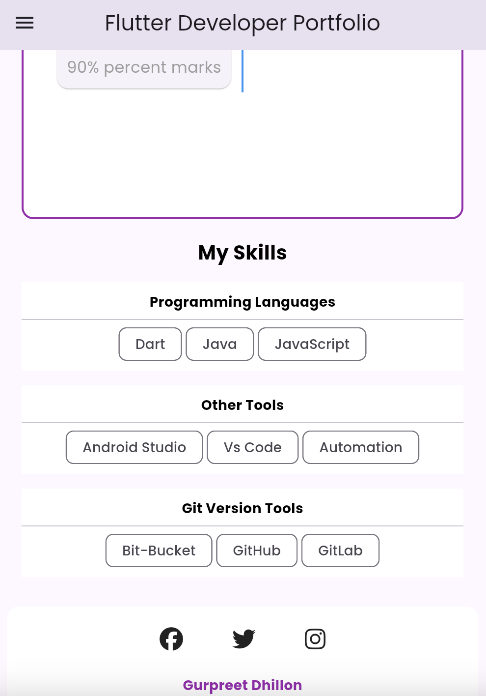
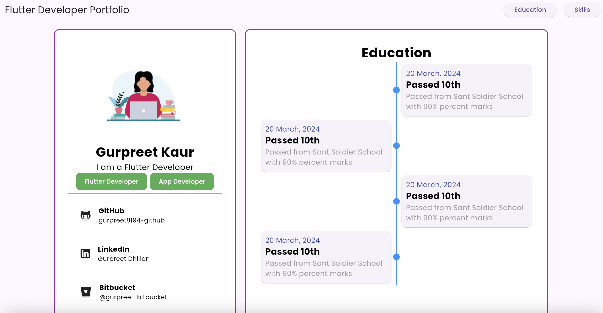
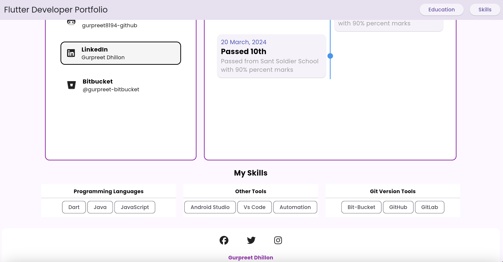

# my_portfolio_web
Welcome to the repository for my Flutter web portfolio! This project demonstrates my skills in Flutter web development, showcasing various projects, skills, and my educational background.
Built with the latest in Flutter technology, this web application is designed to provide an engaging user experience while demonstrating my proficiency in building responsive, modern web applications.

## Screenshots


*Mobile_View_About_Page*


*Mobile_View_Education_Page1*

 
*Mobile_View_Education_Page2*


*Web_View_About_Page*


*Web_View_Education_Page*

## Features

- **Interactive Portfolio:** Explore my projects, skills, and experience with interactive components and animations.
- **Responsive Design:** Optimized for various devices and screen sizes, providing a seamless user experience.

## Tech Stack

- **Flutter:** Cross-platform framework for building natively compiled applications for web, mobile, and desktop from a single codebase
- **Dart:** Programming language used to develop the application.

## Getting Started

1. **Clone the Repository:**

   ```bash
   git clone https://github.com/Gurpreet-hub/my_portfolio_web.git
